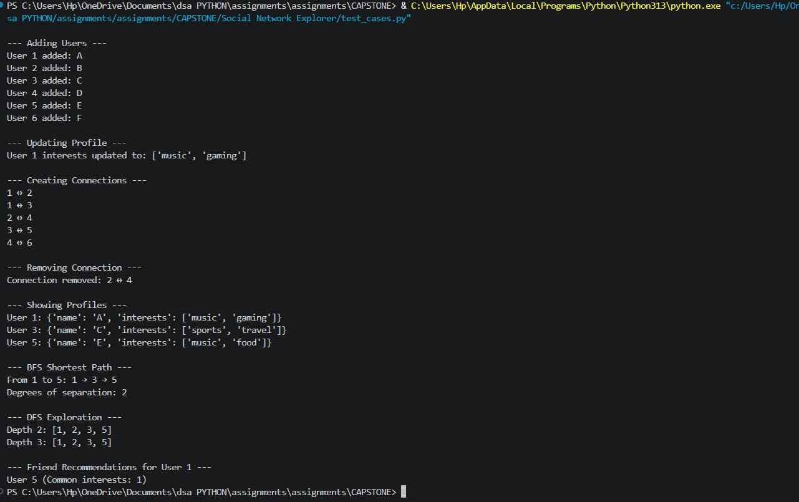

# 🌐 Social Network Explorer (SNE)

## 📌 Overview

Social Network Explorer (SNE) is a CLI-based project that simulates a social network using **Data Structures and Algorithms**.

It allows users to create profiles, connect with others, explore relationships, and get recommendations.

---

## 🎯 Features

### 👤 Profile Management

* Add user
* Get profile
* Update profile
  (Data Structure: Hash Map)

---

### 🌐 Network (Graph)

* Add/remove friendships
* View connections
  (Data Structure: Adjacency List)

---

### 🔍 BFS (Shortest Path)

* Finds shortest connection between users
* Shows **degrees of separation**

---

### 🌲 DFS (Exploration)

* Explores friends up to given depth
* Useful for “friends of friends”

---

### ⭐ Recommendations

* Suggest users based on **common interests**
* Uses sorting + set intersection

---

## 🏗️ Project Structure

```
SNE/
│── profiles.py
│── graph.py
│── algorithms.py
│── recommendations.py
│── test_cases.py
│── README.md
```

---

## ⚙️ How to Run

```bash
python test_cases.py
```

---

## 🧪 Sample Output

```
--- Adding Users ---
User 1 added: A
User 2 added: B
...

--- BFS Shortest Path ---
From 1 to 5: 1 → 3 → 5
Degrees of separation: 2

--- DFS Exploration ---
Depth 2: [1, 2, 3, 5]

--- Friend Recommendations ---
User 5 (Common interests: 1)
User 4 (Common interests: 1)
```

---

## 🖼️ Output Screenshot



👉 (Add your screenshot file in project folder with name **output.png**)

---

## 📊 Time Complexity

| Operation      | Complexity |
| -------------- | ---------- |
| Add User       | O(1)       |
| Add Connection | O(1)       |
| BFS            | O(V + E)   |
| DFS            | O(V + E)   |
| Recommendation | O(n log n) |

---

## 🚀 Future Scope

* GUI (React / Tkinter)
* Database integration
* Location-based suggestions

---

## 👩‍💻by

Vidhi Goyal(2501010083)
